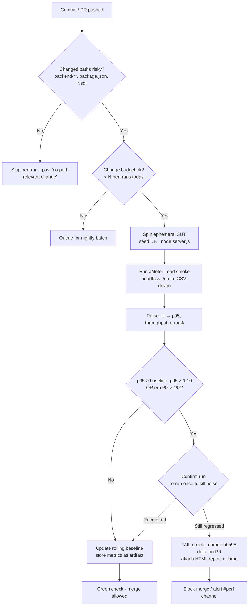

# Task 3 — Continuous Performance Testing (CPT) Proposal · G9.6 (Disrupt)

**Author:** 23127249 · **SUT:** EShop (Node.js + SQLite)

## 1. Goal
Catch performance regressions *before* they reach users by watching the SUT's commits,
running the JMeter E2E workflow only when it is worth it, and **failing the pipeline on a p95
latency regression**. The baseline metric is the **p95 response time** of the transactional
group (`cart → apply-coupon → checkout`), which is the most latency-sensitive path.

## 2. Flow chart

## 3. Decision logic (the "should we even run?" gate)
Running a full perf suite on every commit is wasteful. Gate on:

1. **Path filter** — only run when `backend/**`, dependency manifests, migrations, or the test
   plans themselves change. Docs/frontend-only commits skip.
2. **Budget** — cap perf runs/day (cost control on shared runners); overflow → nightly batch.
3. **Label override** — a `perf` PR label forces a run regardless of path filter.

## 4. Regression rule
- Maintain a **rolling baseline** (median of last K green runs) per endpoint group.
- Flag when **p95 > baseline × 1.10** (10 % budget) **or** error rate > 1 %.
- **Two-phase confirm:** re-run once before failing, to suppress single-run noise (GC pauses,
  cold cache, noisy neighbour). Only a *repeated* regression fails the check.

## 5. Trade-offs

| Dimension | Cost / Risk | Mitigation |
|---|---|---|
| **Compute cost** | Perf runs are minutes-long and CPU-heavy; every-commit is expensive on hosted runners | Path filter + daily budget + nightly batch for low-risk changes |
| **False alarms** | Shared CI hardware is noisy → p95 varies run-to-run; a 10 % threshold can trip on noise, not code | Two-phase confirm; rolling baseline instead of a fixed number; pin a dedicated runner for perf jobs |
| **False negatives** | A 5-min smoke may miss slow leaks that only a 15-min soak reveals | Nightly full Load+Soak; PR-time only a fast smoke |
| **Baseline drift** | Legitimate slow creep silently raises the baseline | Track absolute p95 on a dashboard with an alert on long-term upward trend, not just PR-delta |
| **Environment fidelity** | CI SUT (fresh SQLite, no prod data volume) ≠ production | Seed a representative dataset; treat CI numbers as *relative* regression signal, not absolute SLA |
| **Developer friction** | A blocking perf gate slows merges | Make it *warn* first (non-blocking) for 2 weeks to tune the threshold, then flip to blocking |

## 6. Why p95 (not average)
Average hides tail latency — a few very slow checkouts (lock contention, SQLite write stalls)
barely move the mean but wreck user experience. p95/p99 expose exactly the tail that a
transactional e-commerce path must protect.

## 7. Minimal implementation sketch
- **Trigger:** GitHub Actions `on: [pull_request]` with `paths:` filter.
- **Job:** seed SUT → `jmeter -n -t Load.jmx -l out.jtl` → a small script computes p95 from the
  `.jtl` and compares to `baseline.json` committed in the repo → exit non-zero on regression.
- **Report:** upload the HTML dashboard as a build artifact; post the p95 delta as a PR comment.
